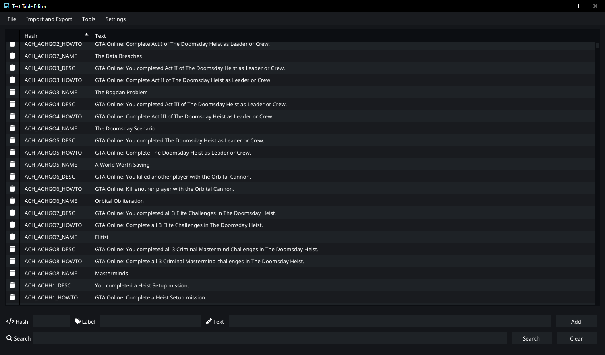
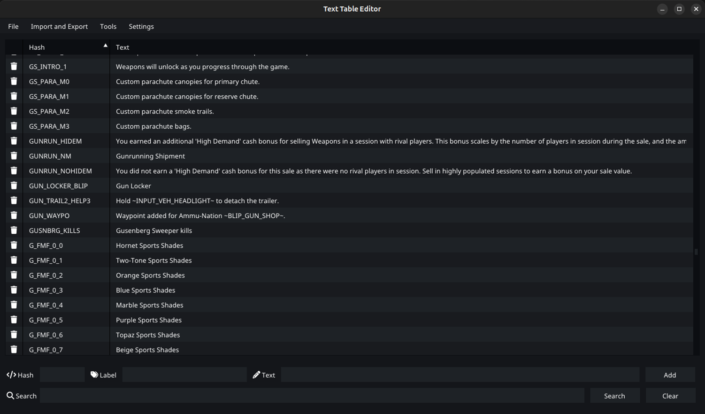

# Grand Theft Auto V Text Table Editor

This tool allows you to view and edit Grand Theft Auto V text files (*.gxt2).




## Features

- **Platform Support:** View and edit game text files for all platforms
  - PlayStation 3
  - Xbox 360
  - PlayStation 4
  - Xbox One
  - PC
  - PlayStation 5
  - Xbox Series X/S
- **Language Support:** Supports all in-game languages
  - American
  - Chinese
  - Chinese (Simplified)
  - French
  - German
  - Italian
  - Japanese
  - Korean
  - Mexican
  - Polish
  - Portuguese
  - Russian
  - Spanish
- **Import and Export:** Import and export content in multiple formats such as JSON, CSV, OXT, and TXT
- **File Creation:** Create new .gxt2 files
- **Shell Extension:** Optional file extension for Windows Explorer (admin rights required)

## Getting Started

### Option 1: Download the latest Release
#### Requirements
- [Vulkan Runtime](https://vulkan.lunarg.com/sdk/home)

**Download the latest Release:** Get the latest release [here](https://github.com/lollolong/gxt2/releases)

### Option 2: Build from Source
#### Requirements
- [CMake](https://cmake.org)
- [Vulkan SDK](https://vulkan.lunarg.com/sdk/home)
- [Visual Studio](https://visualstudio.com)

1. Clone the Repository
```
git clone --recurse-submodules https://github.com/lollolong/gxt2.git
```
2. Build with CMake
```sh
mkdir bin
cd bin
cmake ..
```
3. Compile the generated project in Visual Studio
4. Copy the fonts folder into the executable directory

## Dependencies

- [ImGui](https://github.com/ocornut/imgui)
- [GLFW](https://github.com/glfw/glfw)
- [stb_image](https://github.com/nothings/stb)
- [rapidjson](https://github.com/Tencent/rapidjson)
- [IconFontCppHeaders](https://github.com/juliettef/IconFontCppHeaders)
- [Google Noto Font](https://fonts.google.com/noto)

## Contributions

Contributions are appreciated! If you'd like to contribute to the project, please fork the repository and submit a pull request with your changes.
